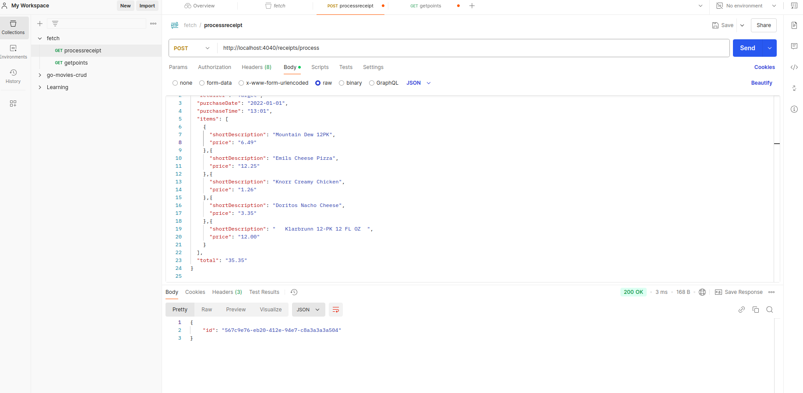
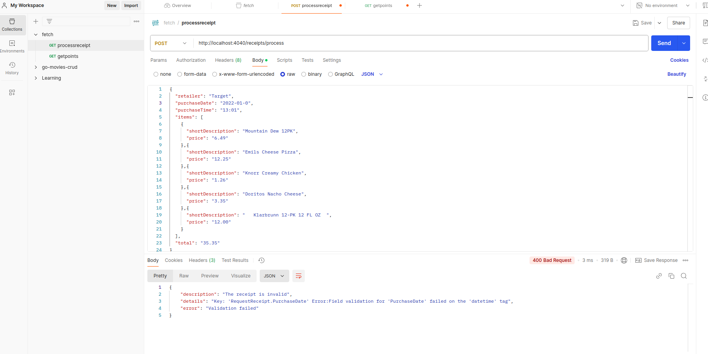
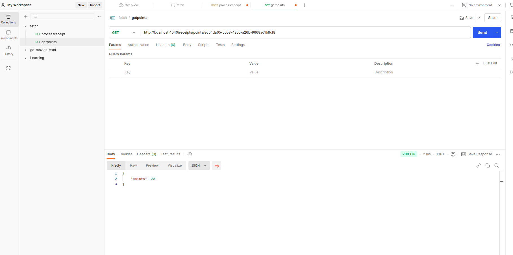
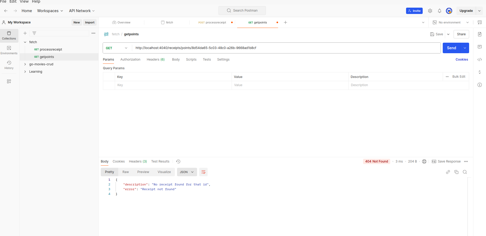

# fetch-rewards-challange
Assignment For The Fetch Rewards Challange (RECEIPT PROCESSOR)

# Receipt Processor API - Assignment Documentation

## Overview

This repository contains the solution for the **Receipt Processor** assignment. The task is to build a RESTful web service in Go that processes receipts and calculates points based on certain rules. The solution is implemented using the Gin framework for the HTTP server and an in-memory data store.

---

## Running the Project

### Prerequisites

Make sure you have Go and Docker installed.

### 1. **Clone the Repository**
```bash
git clone https://github.com/TechnoDiktator/fetch-rewards-challange.git
cd fetch-rewards-challange

```

### 2. **Switch to branch master**
```
git checkout master 
```

### 3. **Run Using Docker**
   - Build the Docker image:
     ```bash
     sudo docker build -t receipt-processor .
     ```
   - Run the Docker container:
     ```bash
     sudo docker run -p 4040:4040 receipt-processor
     ```

   - Test the API:
     ```bash
     curl http://localhost:4040/example
     ```

---

## Future Improvements
   - Persisting data in a database (optional as per assignment).
   - Adding more unit tests for edge cases.
   - Enhancing logging and error handling.


---

## API Endpoints

### **1. Process a Receipt**
- **Endpoint**: `POST /receipts/process`
- **Description**: Accepts a receipt JSON object, processes it, and returns a unique receipt ID.
- **Sample Request Body**:
  ```json
  {
      "retailer": "Target",
      "purchaseDate": "2022-01-01",
      "purchaseTime": "13:01",
      "items": [
          {
              "shortDescription": "Mountain Dew 12PK",
              "price": "6.49"
          },
          {
              "shortDescription": "Emils Cheese Pizza",
              "price": "12.25"
          }
      ],
      "total": "35.35"
  }
  ```
- **Sample Response**:
  ```json
  {
      "id": "3a2b1c4d-567e-89f0-1234-56789abcdefg"
  }
  ```
- **Postman Screenshot**:
  


### **2. Process a Receipt (INVALID RECEIPT)**
- **Endpoint**: `POST /receipts/process`
- **Description**: When an invalid Receipt is sent with attribute errors / format errors / numeric errors , Response will be Invalid Receipt Detailing The Error And The Field At Which The Error Happened.
- **Sample Request Body**:
  ```json
  {
      "retailer": "Target",
      "purchaseDate": "2022-Invalid date",
      "purchaseTime": "13:01",
      "items": [
          {
              "shortDescription": "Mountain Dew 12PK",
              "price": "6.49"
          },
          {
              "shortDescription": "Emils Cheese Pizza",
              "price": "12.25"
          }
      ],
      "total": "35.35"
  }
  ```
- **Sample Response**:
  ```json
  {
      "id": "3a2b1c4d-567e-89f0-1234-56789abcdefg"
  }
  ```
- **Postman Screenshot**:
  


---

### **2. Get Points for a Receipt**
- **Endpoint**: `GET /receipts/points/:id`
- **Description**: Fetches the points for the receipt with the given ID.
- **Sample Request**:
  ```
  GET /receipts/points/3a2b1c4d-567e-89f0-1234-56789abcdefg
  ```
- **Sample Response**:
  ```json
  {
      "points": 28
  }
  ```
- **Postman Screenshot**:
  


### **3. Get Points for a Receipt(RECEIPT NOT FOUND)**
- **Endpoint**: `GET /receipts/points/:id`
- **Description**: Will Return An Error If The Receipt Is Not Found In The Memory Store.
- **Sample Request**:
  ```
  GET /receipts/points/3a2b1c4d-567e-89f0-1234-56789abcd
  ```
- **Sample Response**:
  ```json
    {
        "description": "No receipt found for that id",
        "error": "Receipt not found"
    }
  ```
- **Postman Screenshot**:
  


---


## Folder Structure

```
fetch-rewards-challenge/
├── cmd/                # Entry point for the application
├── internal/           # Application logic
│   ├── handlers/       # HTTP handlers
│   ├── services/       # Business logic for receipts and pointscwith helper methods
│   ├── middlewares/    # Middleware for logging the incoming request
│   ├── inmemorydb/     # In-memory data store
│   ├── models/         # Receipt models Request Models
|   ├── utils           # Contains The constants Used In the project (urls and ports)
├── example/            # Contains Example Jsons

├── pkg/                # Reusable utilities (e.g., logger)
├── static/             # Images and other static assets (e.g., Postman screenshots)
├── Dockerfile          # Docker build configuration
├── docker-compose.yml  # Compose file (optional, if needed)
├── README.md           # Documentation

```


## Steps Taken

### 1. **Project Setup**
   - Initialized a new Go project using Go Modules.
   - Created a repository structure to support scalable development, following best practices for organizing Go code.
     - Set up folders for `cmd/`, `internal/`, `pkg/`, `config/`, and `tests/`.
     - Added a `Makefile` for automation of common tasks like running the server and running tests.

### 2. **Dependencies**
   - Installed Gin for the HTTP framework:
     ```bash
     go get -u github.com/gin-gonic/gin
     ```
   - Installed UUID for generating unique receipt IDs:
     ```bash
     go get github.com/google/uuid
     ```
   - (Optional) Installed Swagger for API documentation:
     ```bash
     go get -u github.com/swaggo/gin-swagger
     go get -u github.com/swaggo/files
     ```
   - (Optional) Installed Testify for unit testing:
     ```bash
     go get github.com/stretchr/testify
     ```

### 3. **Folder Structure**
   - Organized the code into logical modules:
     - `cmd/api/main.go` — Entry point for the application.
     - `internal/handlers/` — Contains the logic for handling HTTP requests.
     - `internal/services/` — Business logic for calculating points based on receipt data.
     - `internal/repository/` — In-memory store to hold receipts.
     - `internal/models/` — Structs and validation for receipt data.
     - `pkg/logger/` — Custom logger for the application.
     - `tests/` — Unit tests for the handlers and services.
   - Used `Makefile` for easy automation of common tasks.

### 4. **API Implementation**
   - Implemented two main endpoints:
     1. **`POST /receipts/process`**: Accepts a receipt in JSON format and generates a unique ID for it.
     2. **`GET /receipts/{id}/points`**: Retrieves the points for a receipt by ID.

### 5. **Points Calculation Logic**
   - Implemented the logic for calculating points based on the rules provided in the assignment.
     - Points for retailer name length.
     - Points for total amount based on the conditions (round dollar, multiple of 0.25, etc.).
     - Points for items based on description length and price.
     - Points for the day and time of purchase.

### 6. **Testing**
   - Wrote unit tests for both handlers and services.
   - Focused on testing the API response as well as the correctness of point calculations.


---


